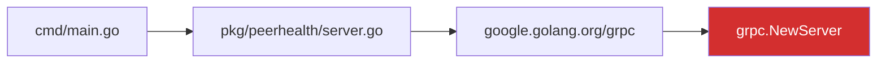

# Vigil v0.0.3 Plan

## Context

v0.0.2 shipped with a complete triage+fix pipeline (5 strategies, validation, PR creation, Jira writeback). Recent additions: `--config`, `--commit`, `--go-version`, `--format html`, ARGUS dual sources, fix-function reachability, OCP lifecycle externalization.

v0.0.3 focuses on four areas: intelligent routing, enhanced reachability, agentic mode, and rich output. Snyk is deferred to v0.0.4.

---

## Feature 1: Intelligent Routing

**Problem**: Currently, `--fix` blindly runs the dependency-bump cascade for all `FixableNow` CVEs. Some CVEs need code-level changes (deprecated API migration, vendor patches) that dependency bumps can't solve. The Claude preprocessor exists (`pkg/preprocess/preprocess.go`) but isn't wired in.

**Design**: Add a routing step between classification and fix that determines the right approach:

```
classify.Classify()
    ↓
route.Route()  ← NEW
    ├─ DependencyBump  → fix.Run() (existing cascade)
    ├─ SemanticFix     → AI-assisted workflow (Claude)
    ├─ GoMinorBump     → fix.Run() with GoMinor strategy
    └─ Manual          → report only, flag for human
```

**Implementation**:

1. **`pkg/route/route.go`** (new package):
   ```go
   type Route string
   const (
       RouteDependencyBump Route = "dependency-bump"
       RouteGoMinor        Route = "go-minor"
       RouteSemanticFix    Route = "semantic-fix"
       RouteManual         Route = "manual"
   )
   
   func Decide(result *types.Result, digest *preprocess.CVEDigest) Route
   ```
   Decision logic:
   - If fix is a Go stdlib CVE + go directive bump needed → `RouteGoMinor`
   - If fix has a known module version → `RouteDependencyBump`
   - If Claude digest says `Actionable: false` or keywords include "api-migration", "refactor" → `RouteSemanticFix`
   - If classification is `NotGo` or `Misassigned` → `RouteManual`

2. **Wire into `cmd/scan.go`** (replace the current `scanFix` block):
   - After `assess.Run()`, optionally call `preprocess.Process()` (if `ANTHROPIC_API_KEY` set)
   - Call `route.Decide()` to get route
   - Switch on route: `DependencyBump`/`GoMinor` → `fix.Run()`, `SemanticFix` → log as "needs AI fix" (v0.0.3 reports only, v0.0.4 invokes), `Manual` → skip

3. **Add ROUTE column to scan output** — show which route was chosen per ticket

4. **Activate ARGUS skills** — currently skills are only listed by name in PR descriptions. v0.0.3 should:
   - Use `vulnerability-management` skill timelines in priority calculation (Critical: 30d SLA, Important: 60d, Moderate: 90d)
   - Use `go-security` skill patterns in govulncheck interpretation
   - Run `differential-review` skill on generated fix diffs before PR creation (`--security-review` flag on fix)
   - Include relevant skill content excerpts (not just names) in PR descriptions
   - Use `variant-analysis` post-fix to check for related CVEs in the same dependency chain
   - Use `fp-check` heuristics before marking ambiguous cases as FixableNow

5. **Embed skill content in PRs** — replace name-only bullets with excerpted guidance sections from matched skills (filtered to <500 chars per skill)

**Files**: new `pkg/route/route.go`, `pkg/route/route_test.go`; modify `cmd/scan.go`, `pkg/pr/description.go`, `pkg/fix/validate.go`

---

## Feature 2: Reachability Mode for Patch Release Decisions

**Problem**: The team has a Google Doc listing ~60 CVEs fixable via Go bumps on older operator versions (far-0.2, mdr-0.3, etc.). They need to know: "Is a patch release to this old version justified? Is the fix only needed on main, or do we need to backport?"

**Design**: New `vigil reachability` command — runs multi-branch reachability analysis to answer the backport question. More than just govulncheck: combines source reachability, fix-function analysis, OCP lifecycle, and cross-branch comparison.

**Usage (v0.0.3 — single version)**:
```bash
vigil reachability --component far --version 0.2
vigil reachability --component far --version 0.2 --format html > far-0.2-reachability.html
```

**v0.0.4 will add**: `--version 0.2,0.4` (multi-version) and `vigil reachability --component far` (all branches with cross-branch verdict).

**Multi-signal analysis per branch**:

| Signal | Source | What it tells you |
|--------|--------|-------------------|
| govulncheck | `RunGovulncheckWithVersion()` | Source-level call path reachability |
| Fix-function match | `fetchFixFunctions()` + call path comparison | Are the *specific fixed functions* called? |
| Go version | go.mod + downstream Containerfile | Is the fix version deployable? |
| OCP lifecycle | `lifecycle.LookupSupportPhase()` | Is this branch still supported (GA/EUS/EOL)? |
| Branch diff | Compare vuln sets across branches | Is this CVE reachable on main too, or only on older branches? |

**Output table (per branch)**:
```
╭─── FAR Reachability: release-0.2 (Go 1.20, OCP 4.14 EUS2) ───╮
│ CVE            PACKAGE      REACH         FIX-FUNC   BACKPORT? │
│ CVE-2025-61726 net/url      📦 PKG-LEVEL  ✓ match    Yes       │
│ CVE-2025-68121 crypto/tls   🚫 NOT-IMPORT ✗ mismatch No        │
│ CVE-2026-32280 crypto/x509  📦 PKG-LEVEL  ✓ match    Yes       │
│ CVE-2026-32282 os           🚫 NOT-IMPORT ✗ mismatch No        │
│                                                                 │
│ Summary: 2 of 4 need backport (2 not reachable on this branch) │
╰─────────────────────────────────────────────────────────────────╯

╭─── FAR Reachability: main (Go 1.25.9, active development) ─────╮
│ CVE            PACKAGE      REACH           FIX-FUNC   BACKPORT?│
│ CVE-2025-61726 net/url      🎯 REACHABLE    ✓ match    Fix here │
│ CVE-2025-68121 crypto/tls   📦 PKG-LEVEL    ✓ match    Fix here │
│ CVE-2026-32280 crypto/x509  🎯 REACHABLE    ✓ match    Fix here │
│ CVE-2026-32282 os           🎯 REACHABLE    ✗ mismatch No       │
│                                                                  │
│ Summary: 3 of 4 need fix on main                                │
╰──────────────────────────────────────────────────────────────────╯

v0.0.4 cross-branch verdict (future):
  CVE-2025-61726: Fix on main + backport to 0.2 (reachable on both)
  CVE-2025-68121: Fix on main only (not imported on 0.2)
  CVE-2026-32280: Fix on main + backport to 0.2 (reachable on both)
  CVE-2026-32282: Fix on main only (fix functions not called on 0.2)
```

The `BACKPORT?` column is the key decision aid:
- `Yes` — CVE is reachable on this branch AND fix functions match → needs backport
- `No` — not reachable or fix functions not called → skip this branch
- `Fix here` — this is the main/latest branch, fix goes here regardless
- `EOL` — branch is end-of-life, no backport needed

**Implementation**:

1. **`cmd/reachability.go`** (new command)
2. **`pkg/reachability/reachability.go`** (new package):
   ```go
   type BranchResult struct {
       Branch       string
       GoVersion    string
       OCPVersion   string
       SupportPhase types.SupportPhase
       Vulns        []VulnResult
   }
   type VulnResult struct {
       CVEID         string
       Package       string
       Reachability  string  // REACHABLE/PACKAGE-LEVEL/etc.
       EntryPoint    string  // source file if reachable
       FixFuncMatch  bool    // do fix CL functions match call paths?
       NeedsBackport bool    // computed verdict
       CVSS          float64
   }
   func Analyze(repoPath, branch string) (*BranchResult, error)
   // v0.0.4: func AnalyzeAll(repoPath string, branches []string) ([]BranchResult, error)
   // v0.0.4: func CrossBranchVerdict(results []BranchResult) []BackportDecision
   ```

3. **Reuse existing code**:
   - `RunGovulncheckWithVersion()` — per-branch govulncheck
   - `fetchFixFunctions()` + `fixFunctionsInCallPaths()` — fix-function matching
   - `ReleaseBranch()`, `CreateWorktree()` — branch handling
   - `lifecycle.LookupSupportPhase()` — EOL detection
   - `downstream.FetchGoVersionForOperator()` — downstream Go version

**Files**: new `cmd/reachability.go`, new `pkg/reachability/reachability.go` + tests

---

## Feature 3: Agentic Mode (pipe-based, then in-process)

**Problem**: Currently Vigil runs synchronously — scan, then fix. For large-scale operations, detection and fixing should run independently. Detection produces findings, fix consumes them asynchronously.

**Design (Phase 1 — pipe protocol)**:

```bash
# Detection agent outputs JSON findings
vigil scan --component FAR --detect-only > findings.json

# Fix agent consumes them
vigil fix --batch < findings.json

# Or piped directly
vigil scan --component FAR --detect-only | vigil fix --batch
```

**Implementation**:

1. **`--detect-only` flag on scan** (`cmd/scan.go`):
   - Run full assessment pipeline (Jira + govulncheck + Trivy)
   - Output JSON array of `types.Result` to stdout instead of table
   - No fix pipeline, no Jira writeback
   - Structure: `{"findings": [...], "discovered": [...], "metadata": {"component": "FAR", "scanned_at": "..."}}`

2. **`--batch` flag on fix** (`cmd/fix.go`):
   - Read JSON findings from stdin
   - Filter to `FixableNow` only
   - Run fix pipeline for each (with rate limiting)
   - Output JSON results to stdout
   - Structure: `{"fixes": [{"ticket": "RHWA-881", "strategy": "direct", "pr_url": "...", "success": true}, ...]}`

3. **Phase 2 (future)**: In-process mode with goroutines + channel. Detection goroutine pushes to channel, fix goroutine consumes. Triggered by `vigil scan --component FAR --fix --async`.

**Files**: modify `cmd/scan.go` (add `--detect-only`), modify `cmd/fix.go` (add `--batch`); define JSON protocol in `pkg/types/agent.go`

---

## Feature 4: Rich Output

### 4a. Terminal Summary Dashboard

After scan completion, print a compact dashboard:

```
╭──────────────────── Vigil Scan: FAR ─────────────────────╮
│                                                           │
│  📊 Classification     🎯 Reachability                    │
│  🔴🔧 Fixable Now  18   🎯 REACHABLE      3              │
│  🟢✓  Not Reachable 3   📦 PACKAGE-LEVEL 15              │
│  🐍   Not Go        2   🚫 NOT-IMPORTED   3              │
│  ↩️   Misassigned   0   📋 MODULE-LEVEL   2              │
│                                                           │
│  ⚡ Top 5 Action Items                                    │
│  1. 🔴 RHWA-881 crypto/tls  Critical  🎯 REACHABLE       │
│  2. 🔴 RHWA-877 crypto/x509 Critical  📦 PACKAGE-LEVEL   │
│  3. 🟠 RHWA-700 net/url     High      📦 PACKAGE-LEVEL   │
│  ...                                                      │
│                                                           │
│  🔍 9 discovered (no ticket) | 1 trivy-only              │
╰──────────────────────────────────────────────────────────╯
```

**Implementation**: New `printDashboard()` function in `cmd/output.go`. Called after `printCombinedTable()` when output is TTY. Uses box-drawing characters and emojis.

### 4b. Two-Tier HTML Reports

**Tier 1 — Summary page** (`--format html`):
- Classification donut chart (inline SVG)
- Severity distribution bar (Critical/High/Medium/Low)
- Top 10 action items (clickable — each links to anchor in Tier 2)
- Discovered CVEs count (no Jira ticket) with "Create tickets" CTA
- Component/version breakdown mini-table
- Each row has a "▶ Details" link that expands or navigates to Tier 2

**Tier 2 — Verbose page** (`--format html --verbose` or click-through):
- Full sortable/filterable table (all columns)
- Per-CVE mermaid call-path diagrams (for REACHABLE entries)
- Fix-function match details
- Jira comment preview (what Vigil would post)

Both tiers are self-contained HTML files (no external deps except mermaid.js CDN for diagrams). Summary page links to verbose page via `<a href="report-verbose.html#RHWA-881">`.

**Commands**:
```bash
# Summary page (default)
vigil scan --component FAR --format html > far-summary.html

# Both pages
vigil scan --component FAR --format html --verbose > far-verbose.html
# (summary is always generated alongside verbose)
```

**Implementation**: Inline SVG for charts, ~50 lines of JS for sorting/filtering, mermaid.js CDN for call-path diagrams. All in `cmd/output.go`.

**`--format html` applies to all commands** — not just scan:

| Command | Summary page | Verbose page | Mermaid diagrams |
|---------|-------------|-------------|-----------------|
| `vigil scan` | Charts + top actions + table | Full table + diagrams + Jira preview | Yes (verbose) |
| `vigil reachability` | Reachability table + backport verdict | Fix-function details per CVE | Yes (verbose) |
| `vigil assess` | Single-ticket analysis card | Full JSON + call paths | Yes (inline) |
| `vigil watch` | Blocked CVE status dashboard | Registry history | No |

Mermaid diagrams are only generated for REACHABLE entries (where govulncheck returned call paths). They appear in the verbose HTML page — the summary page links to them via anchor tags.

### 4d. ASCII Call-Path Trees in Terminal

For `vigil assess` (single ticket) and `vigil scan --short` (REACHABLE entries), print an ASCII tree showing the call chain:

```
  cmd/main.go
    └─ pkg/controller/remediation.go:42
        └─ sigs.k8s.io/controller-runtime/pkg/client
            └─ google.golang.org/grpc.NewServer  ← 🎯 CVE-2026-33186
```

**Implementation**:
- Parse `VulnEntry.CallPaths` (already has frame-by-frame call chain data)
- New `printCallTree(callPaths []string)` in `cmd/output.go`
- For `assess`: print tree after JSON output (on stderr, so JSON stays clean on stdout)
- For `scan --short`: print trees after the main table for REACHABLE rows only

**v0.0.4 follow-up ideas to improve from here**:
- Interactive terminal mode: click/navigate through call paths with arrow keys (TUI)
- Color-code each frame by origin: green = operator code, yellow = k8s deps, red = vulnerable package
- Add line numbers and link to `go doc` for each function in the chain
- Aggregate common paths: if 3 CVEs share the same entry point, show once with multiple CVE tags
- Export call trees as DOT graph format for Graphviz rendering

### 4c. Mermaid Call-Path Diagrams

For REACHABLE CVEs, generate mermaid flowcharts showing the call path from operator code to the vulnerable function:



**Implementation**:
- Parse `callPaths` from govulncheck `VulnEntry`
- Generate mermaid syntax per REACHABLE vuln
- In HTML output: embed mermaid.js CDN link + render inline
- In terminal: print as ASCII art (simplified)
- In markdown reports: output as mermaid code blocks (renders on GitHub)

**Files**: `cmd/output.go` (dashboard, HTML charts, mermaid), no new packages

---

## Implementation Order

| Phase | Feature | Effort | Dependencies |
|-------|---------|--------|-------------|
| 1 | Reachability command | Small | None — new command, reuses existing |
| 2 | ASCII call-path trees | Small | Parse existing VulnEntry.CallPaths |
| 3 | Terminal dashboard | Small | After scan table rendering |
| 4 | Two-tier HTML (summary + verbose + mermaid) | Medium | Extends existing HTML output |
| 5 | Activate ARGUS skills in decisions | Medium | Skill content parsing |
| 6 | Intelligent routing (`pkg/route`) | Medium | Skills + Claude preprocessor |
| 7 | `--detect-only` + `--batch` (agentic pipe) | Medium | JSON protocol definition |
| 8 | Differential review on fix diffs | Small | After routing works |
| 9 | Variant analysis post-fix | Small | After fix pipeline |

Phases 1-4 (output) are independent. Phases 5-6 (routing + skills) build on each other. Phases 7-9 (agentic + post-fix) can follow in any order.

**Not in v0.0.3** (deferred):
- Snyk integration (v0.0.4, depends on RHWA-632)
- ExploitIQ oracle (v0.0.4, needs self-hosted deployment)
- Multi-branch reachability comparison (v0.0.4)
- In-process async mode (v0.0.4, after pipe protocol proves out)
- ASCII interactive TUI for call paths (v0.0.4)

---

## Verification

- `vigil reachability --component far --version 0.2` outputs reachability table
- `vigil scan --component FAR --short` shows dashboard after table (TTY only)
- `vigil scan --component FAR --format html > report.html` has pie chart + sortable table + mermaid diagrams
- `vigil scan --component FAR --detect-only | vigil fix --batch --dry-run` round-trips correctly
- `go test ./...` passes for all new packages (route, reachability)
- Dashboard renders correctly in container: `podman run ... vigil scan --component FAR --short`
